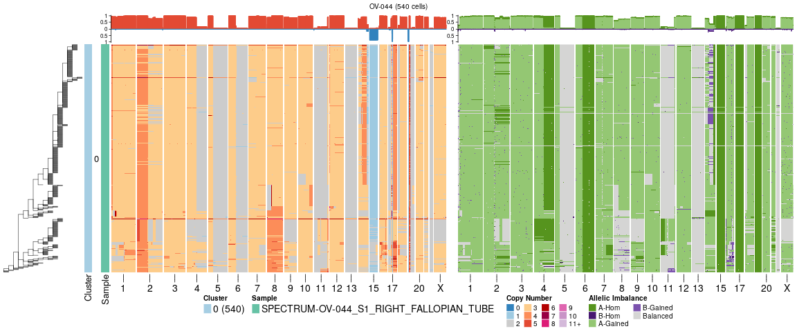

## sitka

This is a snakemake pipeline to run sitka tree inference.

### Inputs

Required input is the per bin per cell copy number tables produced by signals. The final step of the pipeline plots the paired total copy number heatmap and the haplotype specific copy number heatmap ordered by the inferred tree. Tree inference is based on total copy number, therefore the pipeline will work using the total copy number tables from HMMcopy, but the last rule `plotsitka` will need to be modified.

### Outputs

This pipeline produces 4 different sitka outputs:

* **{sample}-tcn-tree.newick** sitka using total copy number
* **{sample}-tcnploidygrow-tree.newick** sitka using total copy number where tree is first constructed using only those cells that have modal ploidy across all cells. In a second step, cells with other ploidy values are grafted onto the tree using `corrupt-grow`
* **{sample}-tcnchrom-tree.newick** sitka using total copy number with chromosome markers, one marker per chromosome denoting if the average chromosome copy number is greater or smaller than cell ploidy
* **{sample}-ascn-tree.newick** sitka using allele specific copy number (copy number changepoints only)

For each tree (`{sample}-{input_type}-tree.newick`) there is also a `{sample}-{input_type}-tree-processed.newick` tree which removes `cell_` from the cell_ids and attempts to remove long chains in the tree that are likely replicating cells, see step 4 below.

### Steps

1. `hmmcopy_to_sitka_tree_*` this converts the binned data to the binary input required by sitka based on copy number changepoints. In this implementation only internal changepoints (ie whole chromosome changes are not included) based on total copy number are included. Changepoints are jitter fixed as described in the sitka paper, aligning changepoints +/- 2 bins. Singleton changepoints and those present in < 0.1% of cells are removed.
2. `sitka_tree_inference` Parameters: fpr = 0.1, fnr = 0.5, nscans = 3000. See `config.yaml`
3. `sitka_tree_consensus`, `sitka_tree_average_tip_indicators` & `sitka_tree_decode` These rules compute the consensus tree
4. `formatsitka` This rule removes tips that are loci and not cells, removes the "cell_" string from the tips and attempts to remove the "finger" clades, long chains of that likely represent early or late replicating cells. This is done by trying to identify clades that consist of a high fraction of singletons - nodes with only one descendent. To do this nodes are ordered by their fraction of singletons and then nodes are progressively removed until 3% of cells are filtered out. This can be adjusted with the `frac_cells` parameter in `remove_fingers` function in `scripts/utils.R`.
5. `plotsitka` plots the tree + heatmaps.

